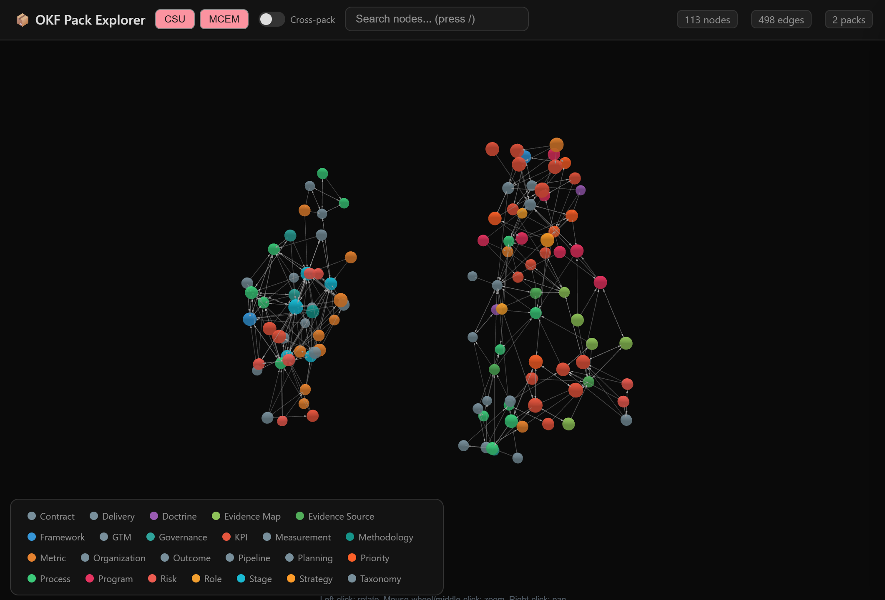
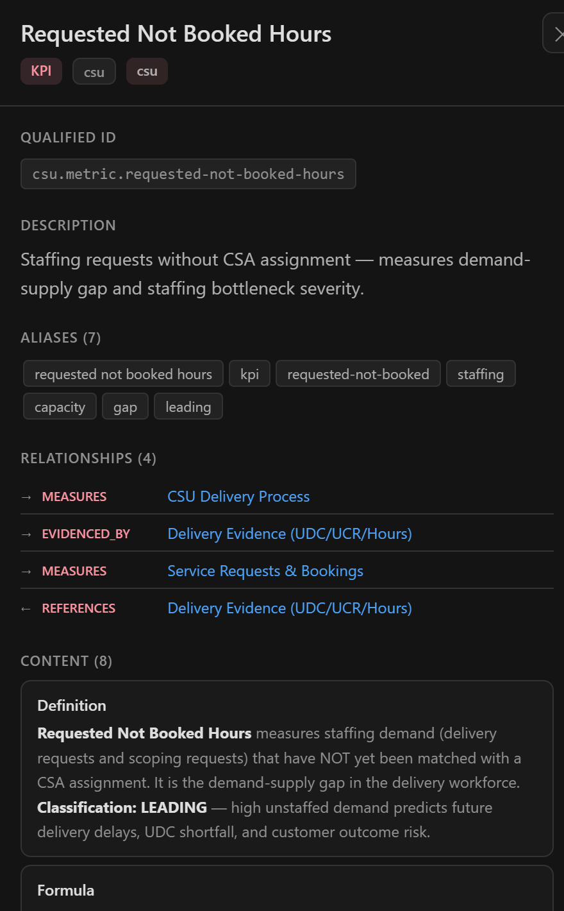
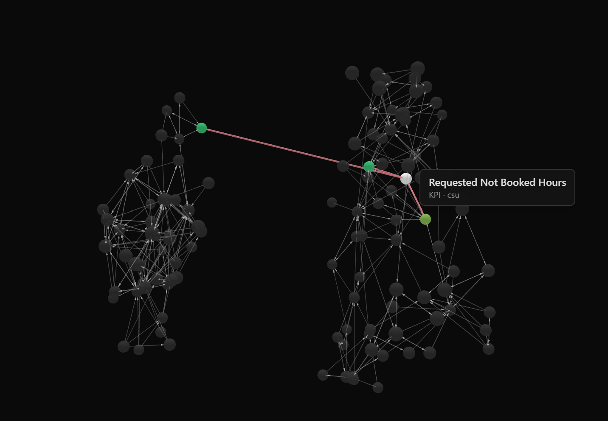

# Synapse Agentic Knowledge Pack

## Knowledge that works for agents — not just people

---

### The problem

Enterprise knowledge lives in documents. Policies sit in SharePoint. Procedures exist in Word files. Expertise is scattered across wikis, presentations, and the minds of experienced staff.

People can navigate this. They read, interpret, cross-reference, and apply judgement. They know which document matters, which version is current, and which colleague to call when things are unclear.

Agents cannot do this.

When an agent is given a pile of documents, it retrieves fragments. It has no understanding of which concepts are authoritative, how ideas relate to each other, what evidence supports a statement, or when a policy supersedes another. It produces answers that are plausible — not grounded.

The gap between documents and agent-ready knowledge is the problem that Synapse AKP solves.

---

### What an Agentic Knowledge Pack is

An AKP is a compiled, versioned, self-contained knowledge unit. It contains structured concepts, their relationships, supporting evidence, and the rules that govern how they should be used.

It is not a vector database. It is not a document store. It is not a collection of chunks.

It is a knowledge system — authored by people, structured for machines, and governed like code.

An AKP tells an agent:

- **What exists** — the concepts, definitions, processes, and policies in a domain
- **How things connect** — which concepts relate to each other and in what way
- **What is authoritative** — which sources support each claim
- **When something applies** — scope, conditions, temporal validity
- **What to do** — procedures, actions, decision paths

When an agent queries an AKP, it receives structured knowledge with evidence — not document snippets with hope.

---

### How agents consume it

AKPs speak the native agent languages — **MCP** (Model Context Protocol) and **A2A** (Agent-to-Agent). Any tool that understands these protocols can connect to an AKP and query structured knowledge directly.

#### Microsoft Scout

Scout agents equipped with an AKP gain domain expertise without prompt engineering. The knowledge pack tells Scout what it knows, what it doesn't, and what evidence supports each answer. Scout can explain its reasoning because the AKP makes that reasoning traceable.

#### GitHub Copilot and Claude

Development agents, coding assistants, and reasoning tools connect to AKPs through MCP. They gain access to domain knowledge that goes beyond what's in their training data — structured, current, and specific to your organisation.

#### CSU-IQ and specialist agents

Domain-specific agents — customer success advisors, incident responders, onboarding assistants — install knowledge packs relevant to their role. A customer success agent carries the methodology pack. An incident responder carries the operational procedures pack. Each agent becomes an expert in its domain because the knowledge is structured for its consumption, not adapted from human documents after the fact.

#### Any agent, any protocol

AKPs are portable. They are single-file packages that any agent framework can load through MCP or A2A. The retrieval protocol is open. If your tool can speak to agents, it can speak to an AKP.

---

### The consumer experience

From an agent's perspective, working with an AKP is straightforward:

**Ask a question** — receive concepts, evidence, and relationships. Not fragments.

**Explore connections** — follow relationships between concepts. Understand how ideas depend on each other.

**Trace evidence** — every answer points back to its source. Know why the agent believes what it says.

**Stay current** — knowledge packs are versioned and released. When understanding improves, a new version ships. Agents upgrade like software.

---

### Distribution and deployment

Knowledge packs go where your agents are.

**Install from a command line** — a single `pip install` or `akp install` command pulls a pack from GitHub and makes it available to any connected agent. No infrastructure setup. No configuration files. Point at a release, install, serve.

**Share from a folder** — drop an AKP file into a Teams folder, a shared drive, or a OneDrive location. Anyone with access can point their agent at it. Knowledge distribution becomes as simple as file sharing.

**Deploy to the cloud** — for teams that need centralised access, AKPs can be hosted and served from any cloud endpoint. Agents connect over HTTPS. The same knowledge, the same structure, the same evidence — regardless of where it runs.

**Publish on GitHub** — release knowledge packs as versioned GitHub releases. Teams install specific versions. CI/CD pipelines compile and publish automatically when source knowledge changes. Knowledge follows the same release discipline as code.

---

### Composable knowledge — stacking packs

Knowledge packs reference each other. This means you can build layers:

**Standard libraries** — organisation-wide methodology packs. MCEM (the engagement methodology) or CSU (customer success operations) serve as foundational knowledge that everyone shares.

**Domain extensions** — team-specific or region-specific packs that build on the standard library. A country-specific pack references the global methodology and adds local regulations, market context, or regional procedures.

**Local augmentation** — project-level or individual knowledge that extends both layers. A specific engagement might carry its own pack that references both the methodology and the country context.

All of these are served from the same runtime. An agent doesn't know or care how many packs contribute to its knowledge — it queries a unified knowledge space where concepts from different packs connect, reference each other, and provide combined evidence.

> Global methodology (MCEM) → Country-specific (MCEM-Sweden) → Engagement-specific (Customer X)

One agent. Multiple knowledge packs. Unified intelligence.

---

### How knowledge gets into a pack

Behind every AKP is a curation process. Source material goes in — documents, presentations, existing wikis, expert input. Structured knowledge comes out.

This is not automatic summarisation. It is knowledge engineering — identifying concepts, establishing relationships, validating evidence, and resolving conflicts. It is a deliberate act of authoring, supported by tooling, governed by people.

The process turns information into understanding. Documents record what someone wrote. Knowledge packs represent what an organisation knows.

---

### AKP Studio

AKP Studio is the authoring environment where knowledge packs are created and maintained.

It provides:

**Source ingestion** — bring in documents from any format. PDF, Word, PowerPoint, Markdown, web pages. The studio extracts content while preserving what it found and where it came from.

**Knowledge graph editing** — work with concepts and their relationships visually. See how ideas connect, where gaps exist, and where conflicts arise. The graph is the map of what the organisation knows.

**Vector space exploration** — understand how concepts cluster semantically. Find near-duplicates, identify gaps in coverage, and verify that similar ideas are properly connected.

**Governed composition** — AI assists in proposing knowledge structures from source material. People review and approve. Nothing enters the knowledge base without governance. The AI proposes; the human decides.

**Release management** — publish immutable versions of knowledge packs. Track what changed between versions. Roll back if needed. Knowledge is managed like code — versioned, reviewed, released.

The studio is where domain experts, knowledge engineers, and AI work together to create something none of them could produce alone.

---

### What this means in practice

A consulting firm codifies its methodology into an AKP. Every consultant's agent carries the same structured knowledge. New hires have access to decades of expertise from day one — through their agent, not through months of reading.

An operations team captures incident response procedures as structured knowledge. When an incident occurs, the response agent doesn't search documents — it knows the procedure, understands the decision tree, and can explain why it recommends each step.

A product team maintains a knowledge pack of their domain. Customer-facing agents answer questions with authority because they carry the same structured understanding as the product experts.

---

### The difference

Without AKP, agents retrieve document fragments and generate plausible text.

With AKP, agents access structured knowledge and provide grounded, evidence-backed, explainable answers.

The difference is not in the model. It is in the knowledge.

---

*Synapse Agentic Knowledge Pack — structured knowledge for the age of agents.*
